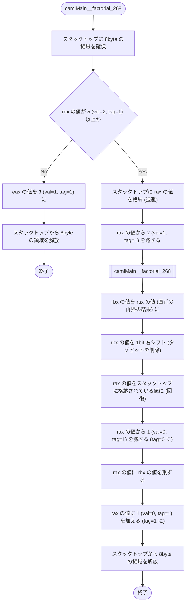
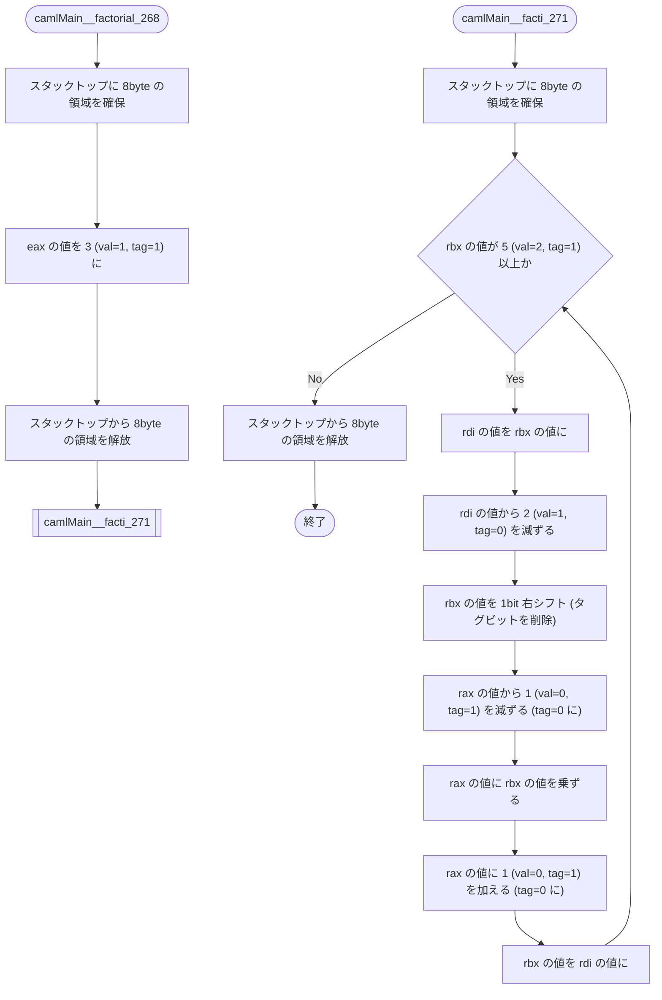

## はじめに

この記事は [あくあたん工房 Advent Calendar 2022](https://adventar.org/calendars/7606) の21日目の記事です．

https://adventar.org/calendars/7606

最近 [SATySFi](https://github.com/gfngfn/SATySFi) の影響で [OCaml](https://ocaml.org/) に入門し，OCaml でパーサコンビネータによって C 言語のパーサを書いたりしています．
そんな OCaml ですが，Scheme, Haskell といった関数型言語と同様に末尾再帰最適化が働きます．

本稿では OCaml によって **一般的な再帰** と **末尾再帰** とを実装し，それぞれから得られるアセンブリソースから末尾再帰最適化がどのように働いているかを読み解きます．

アセンブリソースはフローチャートで解説しています．末尾再帰やアセンブリ言語についても簡単に解説しているので，馴染みがない方もどうぞ．

## 環境

```bash
$ cat /etc/lsb-release 
DISTRIB_ID=Ubuntu
DISTRIB_RELEASE=22.04
DISTRIB_CODENAME=jammy
DISTRIB_DESCRIPTION="Ubuntu 22.04.1 LTS"

$ cat /proc/version
Linux version 5.10.102.1-microsoft-standard-WSL2 (oe-user@oe-host) (x86_64-msft-linux-gcc (GCC) 9.3.0, GNU ld (GNU Binutils) 2.34.0.20200220)

$ ocamlopt --version
5.0.0

$ gcc --version
gcc (Ubuntu 11.3.0-1ubuntu1~22.04) 11.3.0
Copyright (C) 2021 Free Software Foundation, Inc.
This is free software; see the source for copying conditions.  There is NO
warranty; not even for MERCHANTABILITY or FITNESS FOR A PARTICULAR PURPOSE.
```

## 末尾再帰とは

手続き A が手続き B を呼び出すことを考えます．
手続き B の呼び出しが終了すると手続き A も終了するようなとき，この呼び出しを**末尾呼び出し** (tail call) と言います．

これを再帰について当てはめたものが **末尾再帰** です．
**呼び出された側** が終了すると **呼び出した側** も終了するような再帰のことを末尾再帰と言い，末尾再帰である再帰関数のことを末尾再帰関数と言います．一般に関数は返値によって終了するため，末尾再帰関数は **呼び出された側** の返り値をそのまま **呼び出す側** の返り値とする再帰関数と言い換えることができます．

例えば次に示す2つの再帰関数のうち `tail_recursive()` は末尾再帰関数ですが，`non_tail_recursive()` はそうではありません．

:::message alert
次に示す2つの処理は無限再帰を引き起こします．
:::

```c
int tail_recursive(int n) {
    return tail_recursive(1 + n);
}
```

```c
int non_tail_recursive(int n) {
    return 1 + non_tail_recursive(n);
}
```

このことは次のようにフローチャートを書くと分かりやすいと思います．


`tail_recursive()` は自らが呼び出した `tail_recursive()` の返り値をそのまま返値していますが，`non_tail_recursive()` は自らが呼び出した `non_tail_recursive()` の返り値を用いて処理を行ってから返値しています．
このために `tail_recursive()` は末尾再帰関数であり，`non_tail_recursive()` はそうでないのです．

## アセンブリソースの解読

OCamlのアセンブリソースは `gcc` と同様に `ocamlopt` の `-S` オプションで出力できます．

```bash
ocamlopt -S hoge.ml
```

ここでは自然数 $n$ の階乗 $n!$ を求める関数を一般的な再帰と末尾再帰とによって実装し，それぞれアセンブリソースを出力します．

 > 掲載している OCaml ソースに対応しない部分や directive 等は省略しています．

### 一般的な再帰関数

まず一般的な再帰で実装します．

```ocaml
let rec factorial n =
  if n < 2 then
    1
  else
    n * factorial(n - 1)
;;
```

このアセンブリソースは次のようになります．

:::details アセンブリ言語について

本稿で登場する x86-64 アーキテクチャのアセンブリ言語の構文 (AT&T 記法) について簡単に解説します．

それぞれの命令は `[nmemonic] [operand1], [operand2]` の形式で記述され，上から順に実行されます．それぞれの命令の意味は次の通りです．

| 命令 | 意味 |
| - | - |
| **lea** src, dest | dest の値を src の実効アドレスとする |
| **mov** src, dest | dest の値を src の値とする |
| **push** src | src の値をスタックに push する |
| **pop** dest | スタックから pop し，dest の値をこの値とする |
| **add** src, dest | dest の値に src の値を加える |
| **sub** src, dest | dest の値から src の値を減ずる |
| **imul** src, dest | dest の値に src の値を乗ずる |
| **inc** dest | dest の値をインクリメントする |
| **dec** dest | dest の値をデクリメントする |
| **sal** n, dest | dest の値を nbit 算術左シフトする |
| **sar** n, dest | dest の値を nbit 算術右シフトする |
| **cmp** op1, op2 | op2 の値から op1 の値を減じた結果でフラグをセットする |
| **jmp** label | label の位置に jump する |
| **ret** | スタックから pop し，リターンアドレスをこの値とする |

この他 `cmp op1 op2` や算術演算の結果によってセットされるフラグを用いて jump する命令があります．これらの jump 命令は `j` から始まり，例えば `jge label` は 直前の `cmp op1 op2` が op2 >= op1 であれば label の位置にジャンプします．

実際のアセンブリソースでは `addq` や `cmpl` のように命令語の末尾に `q` や `l` が付いています．これは命令語に続く語長を指定するもので，`q` は quad word で 64bit を，`l` は long で 32bit を表します．

オペランドは `%rax` であれば **rax の値**を，`(%rax)` であれば **rax のアドレス**を，`$1` であれば**即値である1** を，それぞれ表します．この他 `-8(%rsp)` であれば **rsp のアドレスに -8 を足したアドレスの値** を，`-8(%rbx, %rax, 8)` であれば **rbx のアドレス + rax のアドレス * 8  + (-8) のアドレスの値** をそれぞれ表します．

また rax, rsp 等はそれぞれ汎用レジスタの名称で，それぞれ次の役割を持っているとされています．ただしいずれも汎用レジスタなので，この他の役割でも用いられます．

| レジスタ | 意味 | 役割 |
| - | - | - |
| rax | accumulator register | 算術演算結果を格納 |
| rbp | base register | ベースアドレスを格納 |
| rsp | stack point register | スタックトップへのポインタを格納 |
| rdi | destination index register | デスティネーションへのポインタを格納 |

rax は64bit のレジスタで，eax はこの下位 32bit を指します．これは他の汎用レジスタについても同様で，例えば esp は rsp の下位 32bit を指します．

:::

```s
camlMain__factorial_268:
    leaq	-328(%rsp), %r10
    cmpq	32(%r14), 	%r10
    jb		.L102

.L103:
    subq	$8, 	%rsp

.L101:
    cmpq	$5, 	%rax
    jge		.L100
    movl	$3, 	%eax
    addq	$8, 	%rsp
    ret

.L100:
    movq	%rax, 	(%rsp)
    addq	$-2, 	%rax
    call	camlMain__factorial_268@PLT

.L104:
    movq	%rax, 	%rbx
    sarq	$1, 	%rbx
    movq	(%rsp), %rax
    decq	%rax
    imulq	%rbx, 	%rax
    incq	%rax
    addq	$8,     %rsp
    ret

.L102:
    push	$34
    call	caml_call_realloc_stack@PLT
    popq	%r10
    jmp		.L103
```

このフローチャートは次のようになります．



OCaml ソースの引数 n にあたる数は rax に格納されており，これが 5 以上であるかによって分岐しています．分岐に `jge` 命令を用いていることから，2 以上であるかによって分岐するのが正しいはずですが，どういうことでしょうか．

これは OCaml の `int` 型が 31bit であることに起因しています．`int` 型は C 言語等では主に 32 bit で表現されますが，OCaml では LSB をタグビットとするために 31bit で表現されます．`int` 型ではタグビットは常に 1 であるため，例えば 2 は 実際に表現したい数値である $10_{(2)}$ を 1 ビット左シフトして LSB を 1 とした $101_{(2)}$，即ち 5 で表されます．

> このことに気付くのが遅れ，筆者はかなり困惑しました．

このことを踏まえてアセンブリソースを読むと，OCaml のアセンブリソースは中々面白い処理をしていることがわかります．返り値 (rax の値) は期待される計算結果を 1 ビット左シフトした上で LSB を 1 とした値になっています．

フローチャートでは，レジスタの値の操作を数値 **val** (LSB以外)とタグビット **tag** (LSB) とで表しているので確認してみてください．

### 末尾再帰関数

次に末尾再帰で実装します．

```ocaml
let factorial n =
  let rec facti i n =
    if n < 2 then
      	i
    else
      	facti (i * n) (n - 1)
  in facti 1 n
;;
```

このアセンブリソースは次のようになります．

```s
camlMain__factorial_268:
    subq	$8, 	%rsp

.L100:
    movq	%rax, 	%rbx
    cmpq	(%r14), %r15
    jbe		.L101

.L102:
    movl	$3, 	%eax
    addq	$8, 	%rsp
    jmp		camlMain__facti_271@PLT

.L101:
    call	caml_call_gc@PLT

.L103:
    jmp		.L102

camlMain__facti_271:
    subq	$8, 	%rsp

.L105:
    cmpq	(%r14), %r15
    jbe		.L106

.L107:
    cmpq	$5, 	%rbx
    jge		.L104
    addq	$8, 	%rsp
    ret

.L104:
    movq	%rbx, 	%rdi
    addq	$-2, 	%rdi
    sarq	$1, 	%rbx
    decq	%rax
    imulq	%rbx, 	%rax
    incq	%rax
    movq	%rdi, 	%rbx
    jmp		.L105

.L106:
    call	caml_call_gc@PLT

.L108:
    jmp		.L107
```

このフローチャートは次のようになります．
ただし一部省略しています．



お気づきでしょうか．**再帰していません**．再帰として記述したはずの処理がループに置換されています．

これが末尾再帰最適化の特徴です．
一般に再帰とループとは互いに置換できることが知られています．
一般的な再帰は **呼び出された側** が終了した後に **呼び出した側** が処理を続けるため，このための情報を保存する必要があります．保存する情報は処理によって異なるため，一般的な再帰を一意な手順でループに書き換えることは困難です．
対して末尾再帰はその必要がなく，一意な手順でループに書き換えることができます．
この性質を利用して末尾再帰をループに書き換えるのが末尾再帰最適化です．

再帰は深くなるごとにローカルな情報を保存する領域を確保しますが，ループはローカルな情報を保存する領域を再利用します．このため再帰からループへの置換によってメモリ領域を節約できます．
これが末尾再帰最適化の利点です．

> 無限再帰による segmentation fault を経験された方は少なくないでしょう．

## おまけ

ところで C/C++ でもコンパイルオプションによっては末尾再帰最適化が働きます．次の無限再帰を引き起こす処理で確認してみます．

> 冒頭で紹介したものです．

```c : test.c
int tail_recursive(int n) {
    return tail_recursive(1 + n);
}

int main() {
    tail_recursive(1);
}
```

まず最適化オプションを付けずにコンパイルしたものを実行します．

```bash
gcc test.c
./a.out
```

segmentation fault が発生して強制終了しました．再帰がメモリを食い潰してしまったためです．

次に `-O2` 最適化オプションを付けてコンパイルしたものを実行します．

```bash
gcc -O2 test.c
./a.out
```

こちらは強制終了しません．末尾再帰最適化によってループに変換され，メモリが再利用されたためです．

> 簡単な実験ですが，メモリ領域を節約していることが確認できます．

## まとめ

末尾再帰最適化は末尾再帰をループに置換し，これによってメモリ領域を節約します．アセンブリソースの解読や実行によって確かにそうであることを確認できました．
